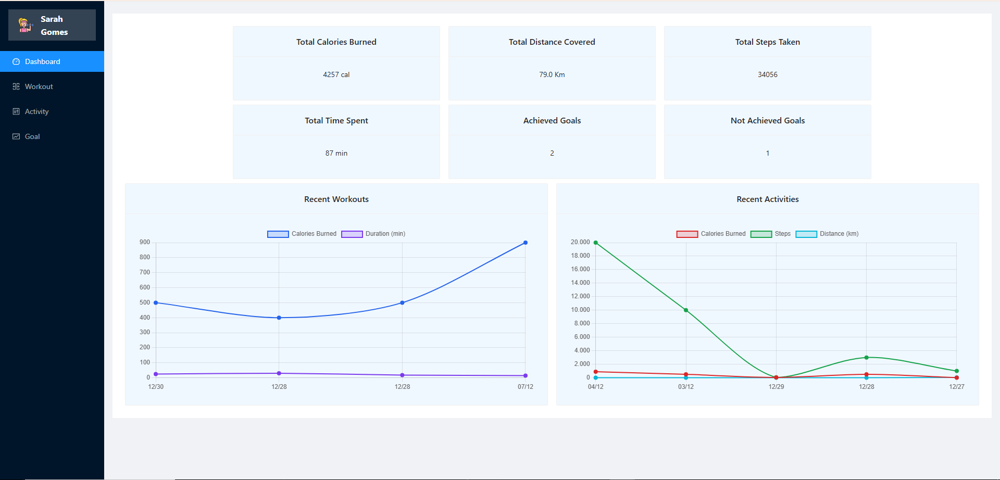
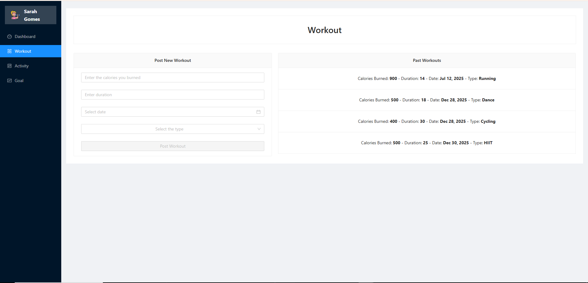
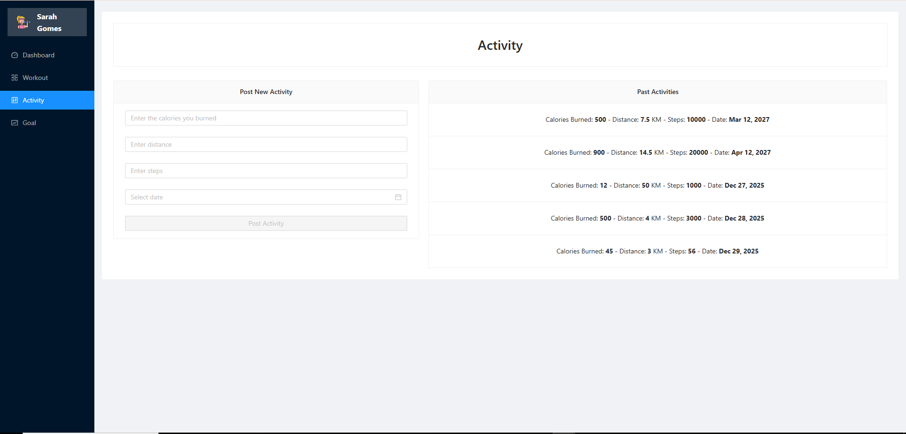
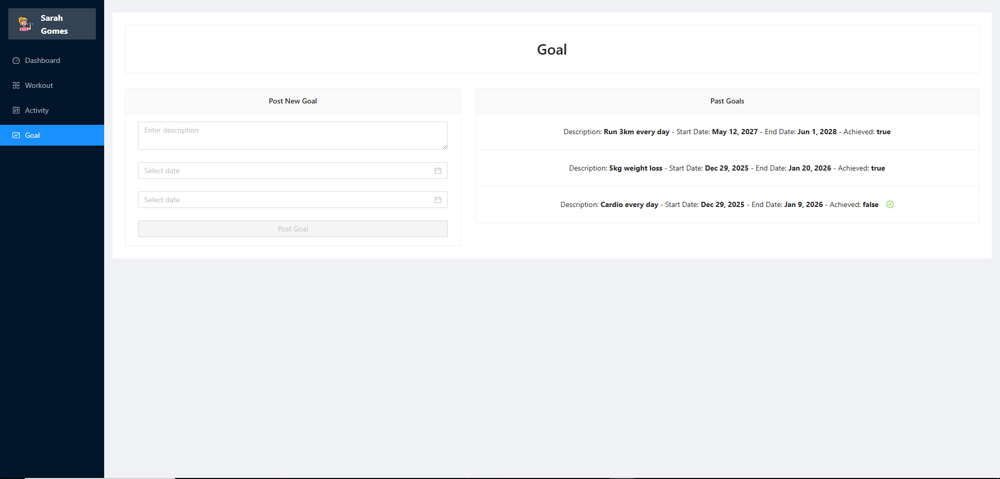

<h1 align="center">  Fitness Tracker </h1>

<p align="center">
  🌎 <strong>Languages:</strong><br>
  <a href="README.md">🇧🇷 Portuguese</a> |
  <a href="README.en.md">🇺🇸 English</a>
</p>

**Fitness Tracker** é uma aplicação full-stack projetada para **acompanhar treinos, atividades e metas pessoais**. Os usuários podem registrar treinos e atividades, definir metas e visualizar estatísticas e progresso através de gráficos dinâmicos.

A aplicação inclui **operações CRUD completas**, **validações de formulários** e uma **integração frontend-backend** fluida com APIs REST.

## 🚀 Como Acessar o Projeto

Você pode rodar o projeto localmente. Passos:

1. Clone o repositório:
```bash
git clone https://github.com/pitercoding/fitness-tracker-app.git
cd fitness-tracker
```
2. Backend:
```bash
cd backend
./mvnw spring-boot:run
```
3. Frontend:
```bash
cd frontend
npm install
ng serve
```
* Abra http://localhost:4200 no seu navegador.

## 🏆 Motivação

Este projeto foi criado para **praticar o desenvolvimento full-stack** através da construção de um sistema realista de acompanhamento de atividades físicas.

Ele me permitiu aplicar conceitos em **Angular, TypeScript, Chart.js, Ng Zorro UI, Spring Boot, APIs REST e práticas de deploy**.

## 📚 Pontos de Aprendizado

Durante o desenvolvimento, fortaleci habilidades em:

* **Frontend:** Angular, TypeScript, SCSS, componentes Ng Zorro, layouts responsivos, gráficos, formulários reativos, roteamento, serviços HTTP.

* **Backend:** Spring Boot, APIs REST, tratamento centralizado de exceções, operações CRUD.

* **Banco de Dados:** MySQL para armazenamento de treinos, atividades e metas.

* **Testes & Validação:** Validações de formulários, testes de API.

* **Gráficos & Análises:** Visualização dinâmica de estatísticas com Chart.js.

## 🧱 Estrutura da Aplicação
| Camada      | Tecnologia           | Função Principal                                             |
| ---------- | ------------------- | ---------------------------------------------------------- |
| Frontend   | Angular + TypeScript | UI para registrar treinos, atividades e metas com gráficos |
| Backend    | Spring Boot          | API REST com validação, CRUD e estatísticas                |
| Banco de Dados | MySQL                | Armazena treinos, atividades, metas                        |
| Deployment | Local / _Produção_   | _Em progresso_                                             |

## ⚙️ Tecnologias & Ferramentas

### Frontend (Angular)
- Angular 20+
- Componentes Ng Zorro Ant Design
- SCSS / CSS3
- Chart.js para gráficos dinâmicos
- Formulários reativos com validação
- Roteamento & componentes standalone

### Backend (Spring Boot)
- Spring Boot 3+
- APIs REST para treinos, atividades, metas e estatísticas
- Validação e tratamento centralizado de exceções
- Camadas de serviço (Service) e repositório (Repository)

### Banco de Dados
- MySQL
- Tabelas para Treinos (Workouts), Atividades (Activities), Metas (Goals) e Estatísticas (Stats)

### Deployment
- Configuração local para desenvolvimento
- Produção (Em progresso)

## 🖼️ Screenshots & Visuais

### Dashboard
- Mostra total de calorias, passos, distância, tempo gasto e metas
- Visualiza treinos e atividades recentes com gráficos de linha



### Treinos & Atividades
- Formulários para registrar treinos e atividades
- Listas de entradas anteriores com funcionalidade de edição/atualização




### Metas
- Formulário para postar novas metas com datas de início/fim
- Listas de metas passadas com opção de marcar como alcançadas



## 🧭 Fluxo da Aplicação
```text
Usuário → Frontend (Angular)
↓
API REST (Spring Boot, Validação, CRUD)
↓
Banco de Dados (MySQL)
↑
(Backend processa as requisições e retorna os resultados)
```
## ✅ Status Atual

| Área        | Status         | Descrição                                         |
|------------ |:-------------: |-------------------------------------------------|
| Backend     | ✅ Concluído   | APIs de CRUD, validação e estatísticas           |
| Frontend    | ✅ Concluído   | Registro de treinos/atividades/metas, dashboard  |
| Integração  | ✅ Testada     | Comunicação Frontend ↔ Backend via HTTP         |
| Banco de Dados | ✅ Operacional | Conectado e sincronizado                        |
| Gráficos    | ✅ Implementado | Gráficos de linha dinâmicos para treinos e atividades |

## 📂 Estrutura de Pastas
```bash
fitness-tracker/
├─ backend/
│  ├─ src/main/java/com/fitness/backend/
│  │  ├─ controller/        # Controllers REST
│  │  ├─ dto/               # Objetos de Transferência de Dados (DTOs)
│  │  ├─ entity/            # Entidades JPA
│  │  ├─ repository/        # Repositórios Spring Data JPA
│  │  ├─ service/           # Serviços de lógica de negócio
│  │  └─ BackendApplication.java
├─ frontend/
│  ├─ src/app/
│  │  ├─ components/        # Treinos, Atividades, Metas, Dashboard
│  │  ├─ services/          # UserService e comunicação com a API
│  │  ├─ shared/            # Módulos compartilhados
│  │  ├─ app.routes.ts      # Configuração de rotas
│  │  └─ arquivos principais da aplicação
│  ├─ public/images/        # Logo e outras capturas de tela
│  └─ environments/         # Configurações de ambiente
├─ .gitignore
├─ README.md
└─ LICENSE
```

## 📜 **Licença**

Este projeto está sob a licença **MIT**.

## 🧑‍💻 Autor

**Piter Gomes** — Aluno de Ciências da Computação (5º Semestre) & Desenvolvedor Full-Stack

📧 [Email](mailto:piterg.bio@gmail.com) | 💼 [LinkedIn](https://www.linkedin.com/in/piter-gomes-4a39281a1/) | 💻 [GitHub](https://github.com/pitercoding) | 🌐 [Portfolio](https://portfolio-pitergomes.vercel.app/)
